# DO5_SimpleDocker-1 Report

## Part 1. Готовый докер

**== Выполнение ==**

- Выкачаем официальный докер образ с **nginx** при помощи `docker pull`

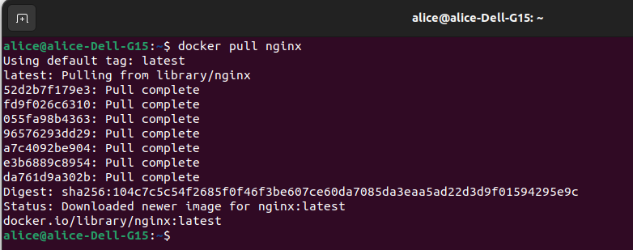

- Проверим наличие докер образа через `docker images`

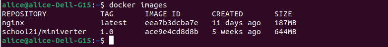

- Запустим докер образ через `docker run -d [image_id|repository]`: `docker run -d ngix`
- Проверим, что образ запустился: `docker ps`

- Посмотрим информацию о контейнере через `docker inspect [container_id]` или `docker inspect [container_name]`

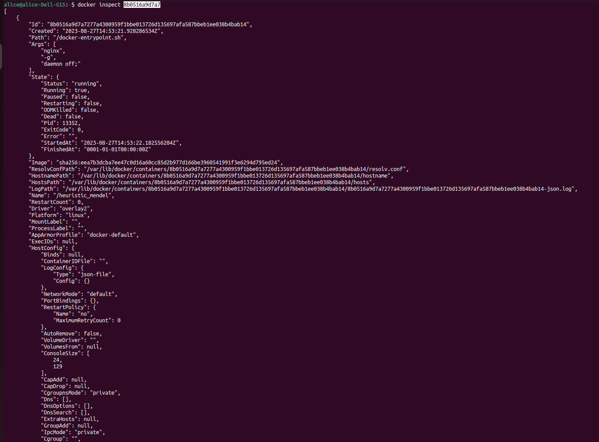
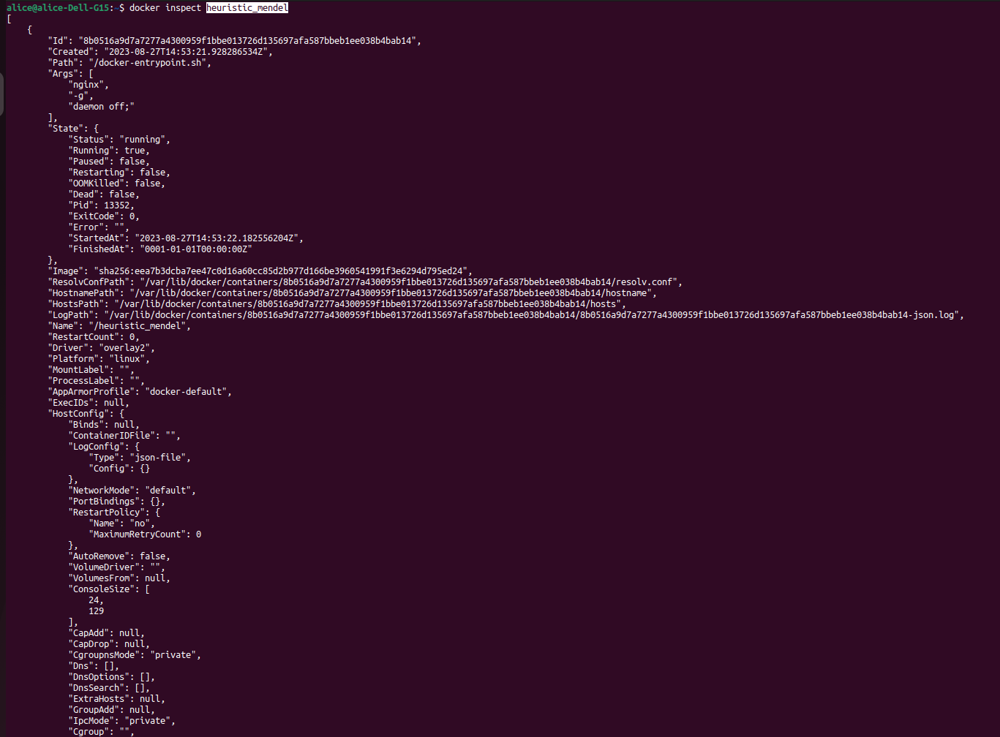

- По выводу команды с помощью `grep` определим _размер контейнера_, _список замапленных портов_ и _ip контейнера_

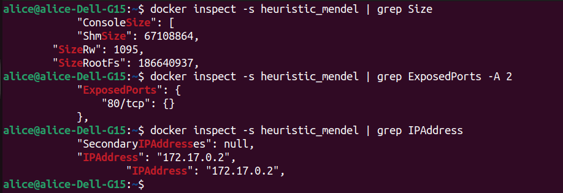

- Остановим докер образ через `docker stop [container_id|container_name]`

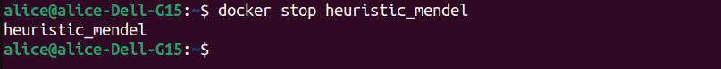

- Проверим, что образ остановился: `docker ps`. Вывод команды должен быть пустым

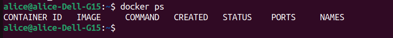

- Запустим докер с портами 80 и 443 в контейнере. Для этого выполним *run* с опцией `--publish` для сопоставления портов

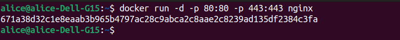

- Команда `docker ps` в колонке _PORTS_ теперь отображает замапленные порты

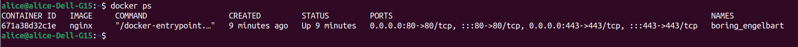

- Проверим, что в браузере по адресу *localhost:80* доступна стартовая страница **nginx**

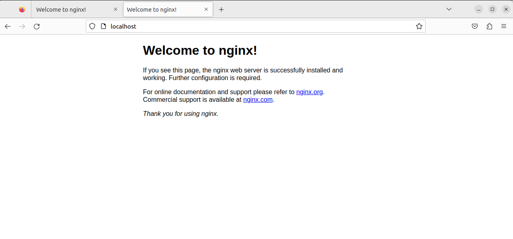

- Перезапустим докер контейнер через `docker restart [container_id|container_name]`. Проверим, что контейнер запустился, с помощью `docker ps`. Колонка _STATUS_ была обновлена: контейнер работает 2 секунды (после перезапуска)

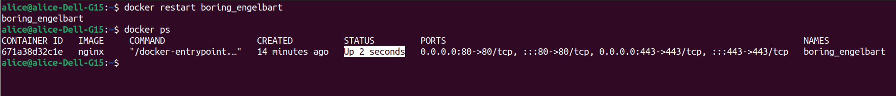

## Part 2. Операции с контейнером

- Прочитаем конфигурационный файл *nginx.conf* внутри докер контейнера _boring_engelbart_ через команду *exec*: `docker exec [container_name] cat [file_path]`

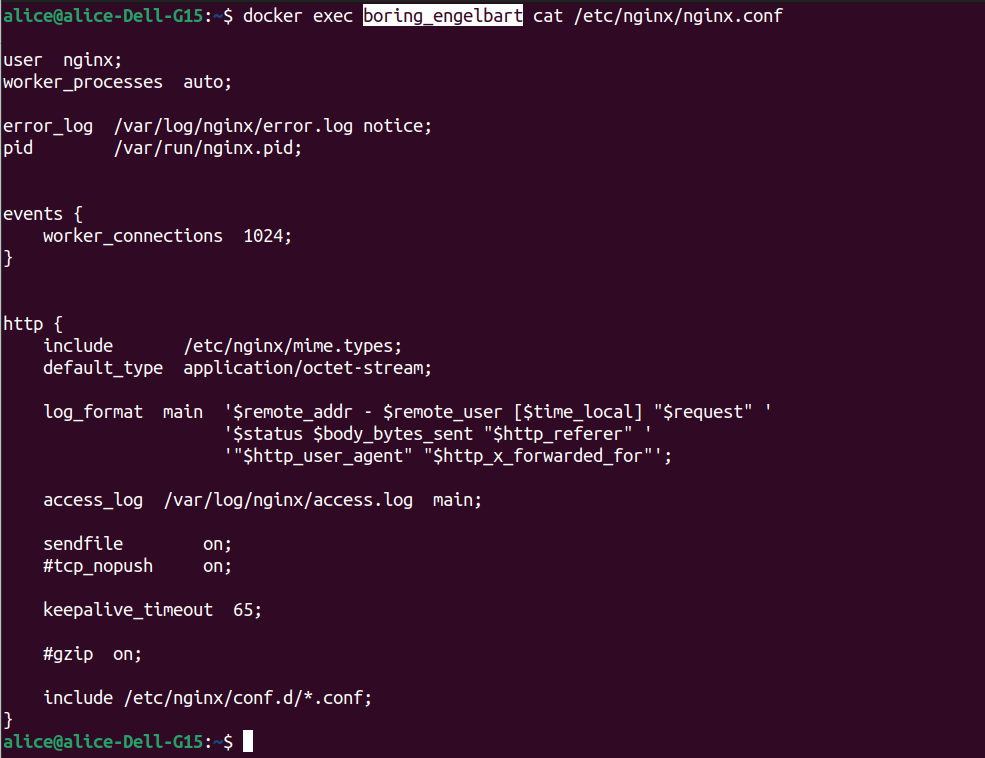

- Создим на локальной машине файл *nginx.conf*: `touch ngix.conf`

- Настроим в *nginx.conf* по пути */status* отдачу страницы статуса сервера **nginx**: добавим блок _server_, а также закомментируем `#include /etc/nginx/conf.d/*.conf;`

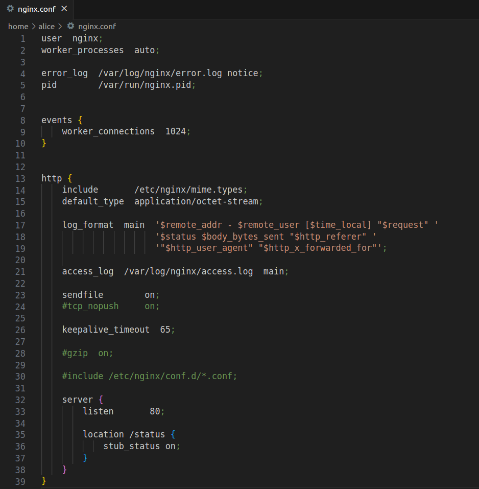

- Скопируем созданный файл *nginx.conf* внутрь докер образа через команду _docker cp_: `docker cp [source_path] [container_name]:[dest_path]`

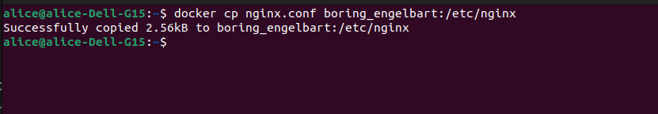

- Перезапустим **nginx** внутри докер образа через команду *exec*: `docker exec [container_name] nginx -s reload`

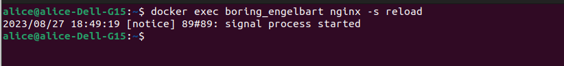

- Проверим, что по адресу *localhost:80/status* отдается страничка со статусом сервера **nginx**

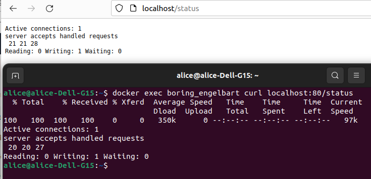

- Экспортируем контейнер в файл *container.tar* через команду *export*: `docker export [container_name] > [file_name]`

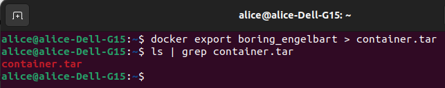

- Остановим контейнер: `docker stop [container_name]`

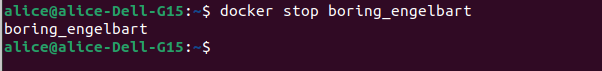

- Удалим образ через `docker rmi [image_id|repository]`, не удаляя перед этим контейнеры

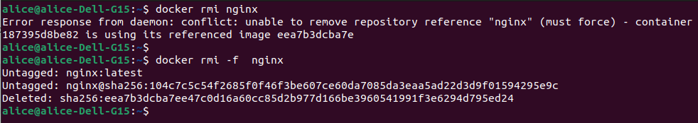

> При простом запуске rmi команда выдает ошибку, сообщающую о том, что удаление образа _ngix_ невозможно из-за использования его контейнером. Запустим удаление с опцией --force (-f), принудительно удаляющей образы

- Удалим остановленный контейнер: `docker rm [container_name]`

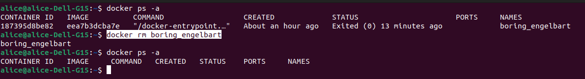

> До удаления контейнера команда `docker ps -a` отображает информацию о нем, после удаления вывод этой команды пуст. Значит контейнер был успешно удален

- Импортируем контейнер обратно через команду *import*

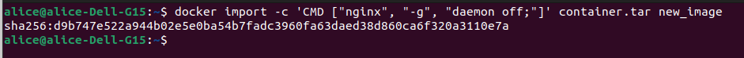

> Так как `docker export` не экспортирует всю информацию о контейнере, при импорте дампа обратно в новый образ докера необходимо указать дополнительные флаги для воссоздания контекста. Поскольку для запуска контейнера необходима одна из инструкций _ENTRYPOINT_ или _CMD_, нужно определить одну из них

- Запустим импортированный контейнер

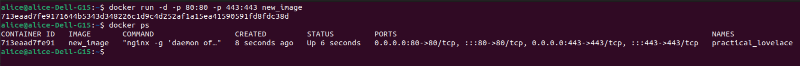

- Проверим, что по адресу *localhost:80/status* отдается страничка со статусом сервера **nginx**

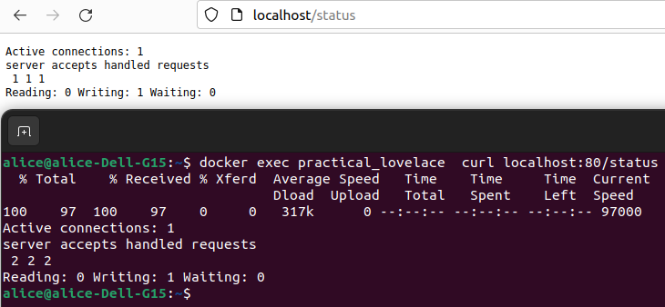

## Part 3. Мини веб-сервер

- Выкачаем официальный докер образ `docker pull nginx` и запустим контейнер с портом 81

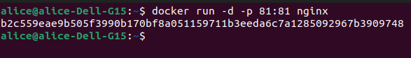

- Напишем мини сервер на **C** и **FastCgi**, который будет возвращать простейшую страничку с надписью `Hello World!`

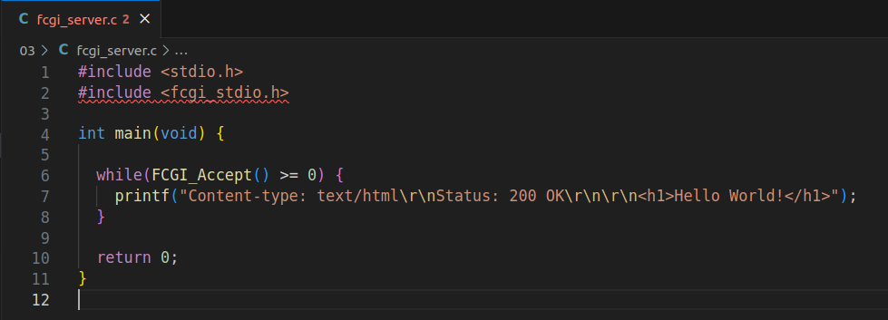

- Напшем *nginx.conf*, который будет проксировать все запросы с 81 порта на *127.0.0.1:8080*

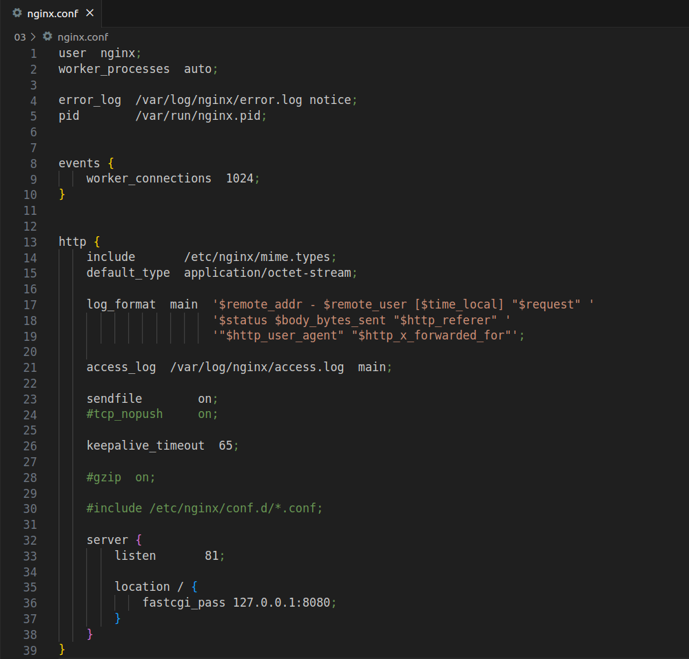

> `fastcgi_pass адрес;` задает адрес FastCGI-сервера

- Скопируем созданные файлы в контейнер с помощью _docker cp_

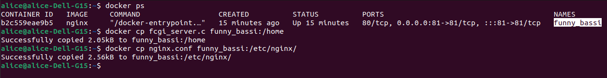

- Зайдем в контейнер с использованием оболочки _bash_ и обновим _apt-get_ 

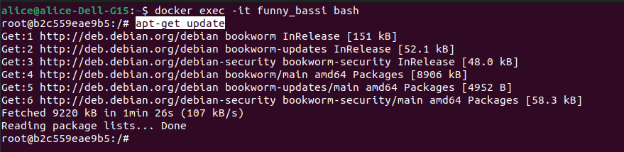

- Скачаем _gcc_ (компиляции FastCgi-приложения на C), _spawn-fcgi_ (порождает процессы FastCGI), _libfcgi-dev_ (содержит заголовочные файлы FastCGI)

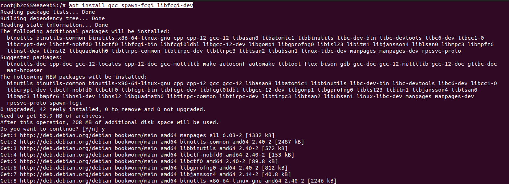

- Скомпилируем FastCGI-приложение, отдающее страничку c `Hello World!`

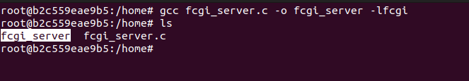

> `-l` указывает, с какой библиотекой скомпилировать файл

- Запустим написанный мини сервер через *spawn-fcgi* на порту 8080

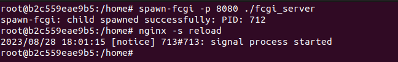

> `spawn−fcgi [опции] [ −− <приложение−fcgi> [аргументы приложения fcgi]]`. В качестве опции указываем -p для указания прослушиваемого порта TCP

- Проверим, что в браузере по *localhost:81* отдается написанная вами страничка

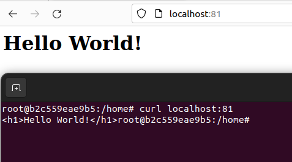

- Положим файл *nginx.conf* по пути *./nginx/nginx.conf*

## Part 4. Свой докер

- Напишем скрипт run.sh для запуска процессов _fcgi_ и _nginx_

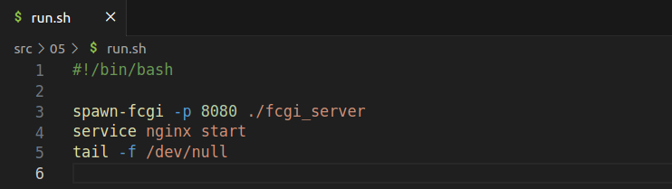

- Напишем свой докер образ

    1. собирает исходники мини сервера на FastCgi из [Части 3]
    2. запускает его на 8080 порту
    3. копирует внутрь образа написанный *./nginx/nginx.conf*
    4. запускает **nginx**

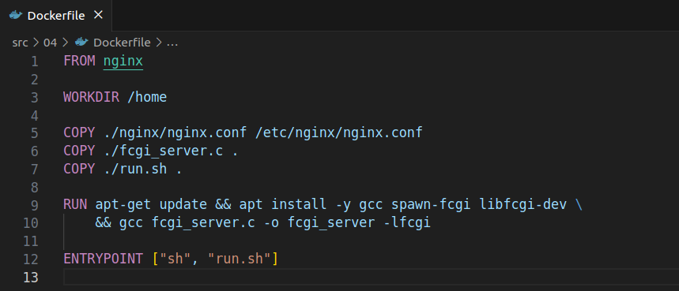

> `FROM nginx`: образ собирается на основе готового **nginx**

- Соберем написанный докер образ через `docker build` при этом указав имя и тег

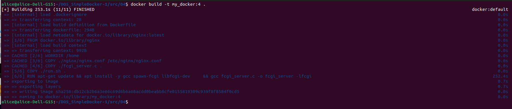

> Синтаксис команды _build_: `docker build [OPTIONS] PATH`. `-t` позволяет задать имя и тег (опционально)

- Проверим через `docker images`, что все собралось корректно

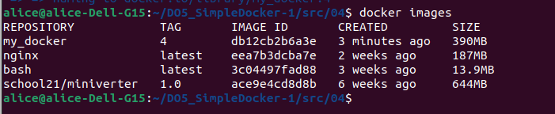

- Запустим собранный докер образ с маппингом 81 порта на 80 на локальной машине и маппингом папки *./nginx* внутрь контейнера по адресу, где лежат конфигурационные файлы **nginx**'а

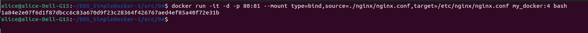

> `--mount type=bind,source=[host-src],target=[container-dest]` позволяет смонтировать папки на хосте и в контейнере

- Проверим, что по localhost:80 доступна страничка написанного мини сервера

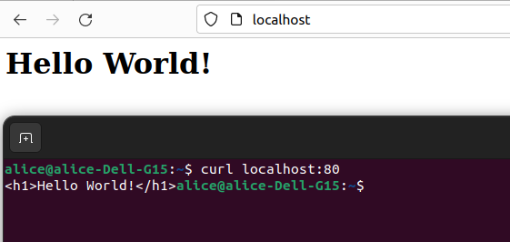

- Допишем в *./nginx/nginx.conf* проксирование странички */status*, по которой надо отдавать статус сервера **nginx**

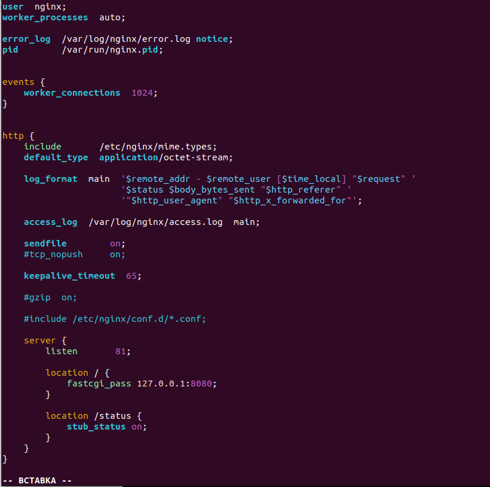

- Перезапустим контейнер

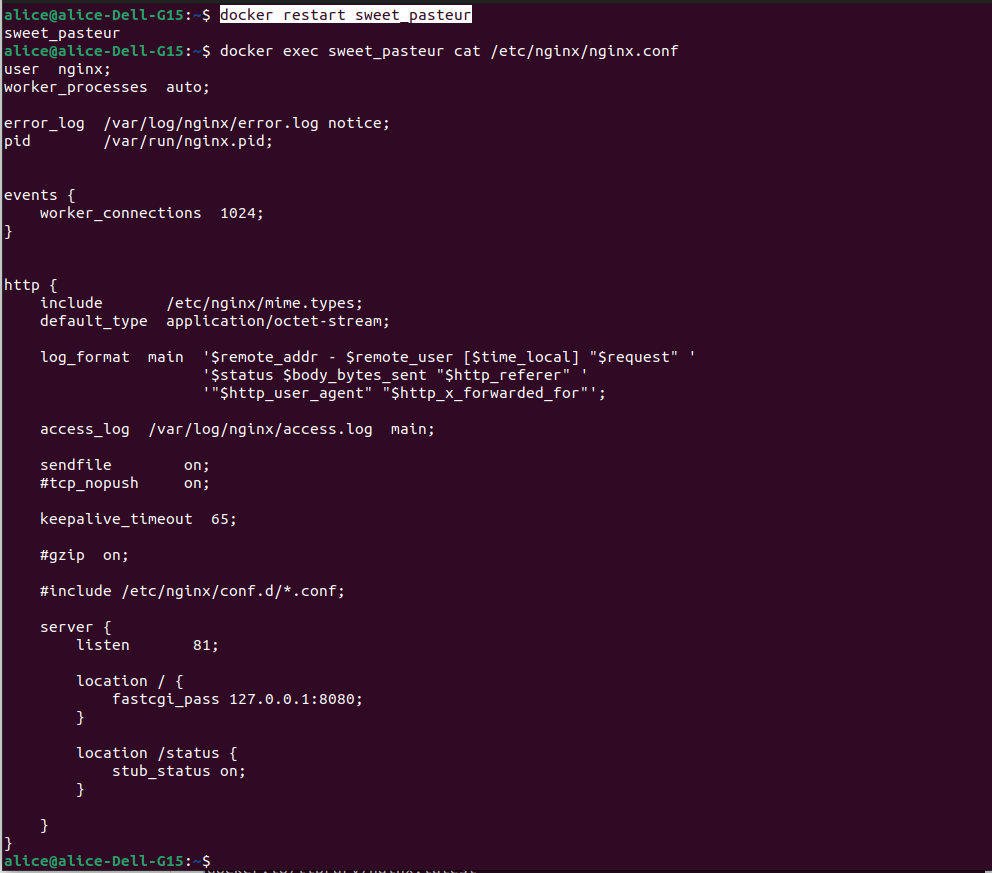

> После сохранения файла и перезапуска контейнера конфигурационный файл внутри докер образа обновляется самостоятельно

- Проверим, что теперь по *localhost:80/status* отдается страничка со статусом **nginx**

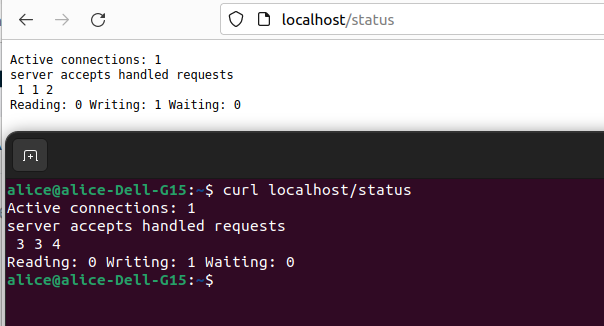

## Part 5. **Dockle**

- Устанавливаем _dockle_ (Ubuntu):

> VERSION=$(
 curl --silent "https://api.github.com/repos/goodwithtech/dockle/releases/latest" | \
 grep '"tag_name":' | \
 sed -E 's/.*"v([^"]+)".*/\1/' \
) && curl -L -o dockle.deb https://github.com/goodwithtech/dockle/releases/download/v${VERSION}/dockle_${VERSION}_Linux-64bit.deb
$ sudo dpkg -i dockle.deb && rm dockle.deb

> sudo dpkg -i dockle.deb && rm dockle.deb

- Просканируем образ из предыдущего задания через `dockle [image_id|repository]`

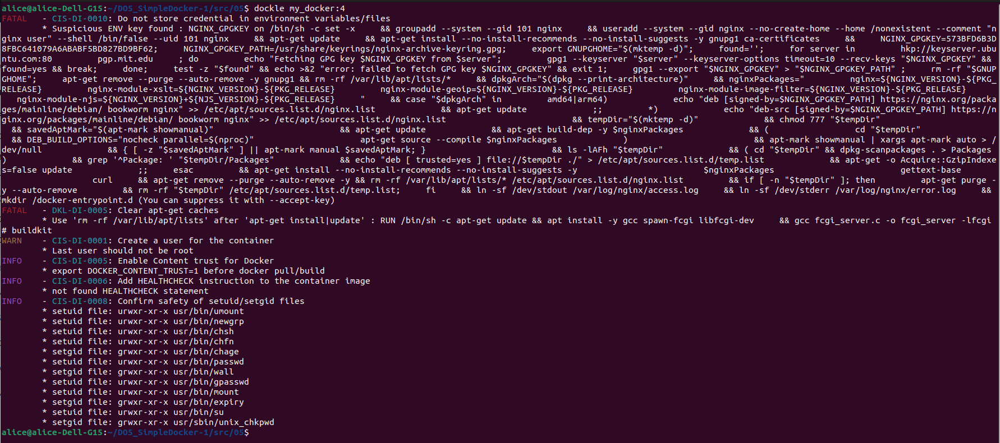

- Исправим образ так, чтобы при проверке через **dockle** не было ошибок и предупреждений

> `rm -rf /var/lib/apt/lists`: очистка apt-get кэша

> `USER my_docker_user`: создать пользователя контейнера

- Соберем новый образ

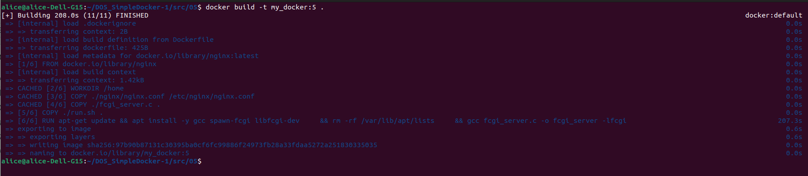

- Просканируем исправленную версию образа: `dockle -ak NGINX_GPGKEY -ak NGINX_GPGKEY_PATH [image_name]:[image_tag]`

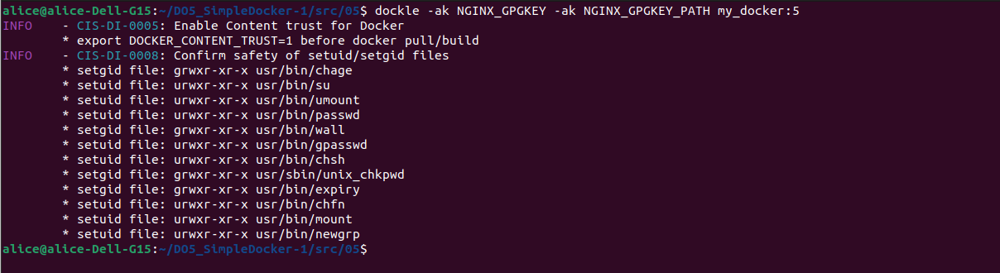

> Так как образ создается на основе _официальной последней версии nginx_, в Dockerfile которой используются NGINX_GPGKEY и NGINX_GPGKEY_PATH, а _Dockle_ в _CIS-DI-0010_ ищет ключевые слова (key, password), то это приводит к ложным срабатываниям. Поэтому запустим dockle с флагом `-ak`

## Part 6. Базовый **Docker Compose**

- Напишем файл *docker-compose.yml*, с помощью которого:
    1. Поднимем докер контейнер из [Части 5]
    2. Поднимем докер контейнер с **nginx**, который будет проксировать все запросы с 8080 порта на 81 порт первого контейнера
    3. Замапим 8080 порт второго контейнера на 80 порт локальной машины

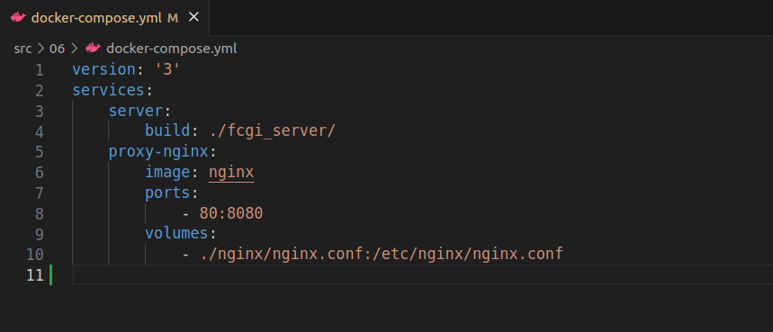

- Остановим запущенные контейнеры

- Соберем и запустим проект с помощью команд `docker-compose build` и `docker-compose up`

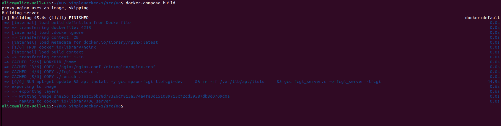

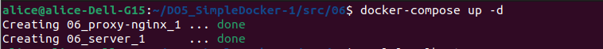

- Проверить, что в браузере по *localhost:80* отдается написанная вами страничка, как и ранее

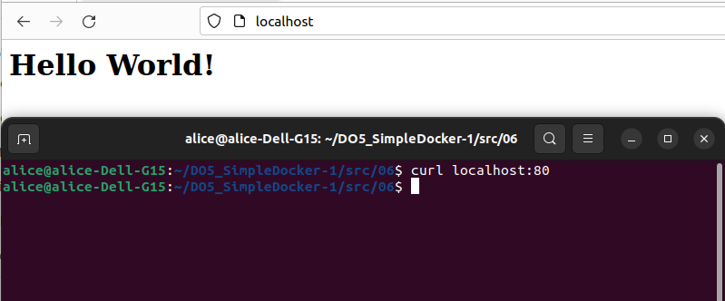

